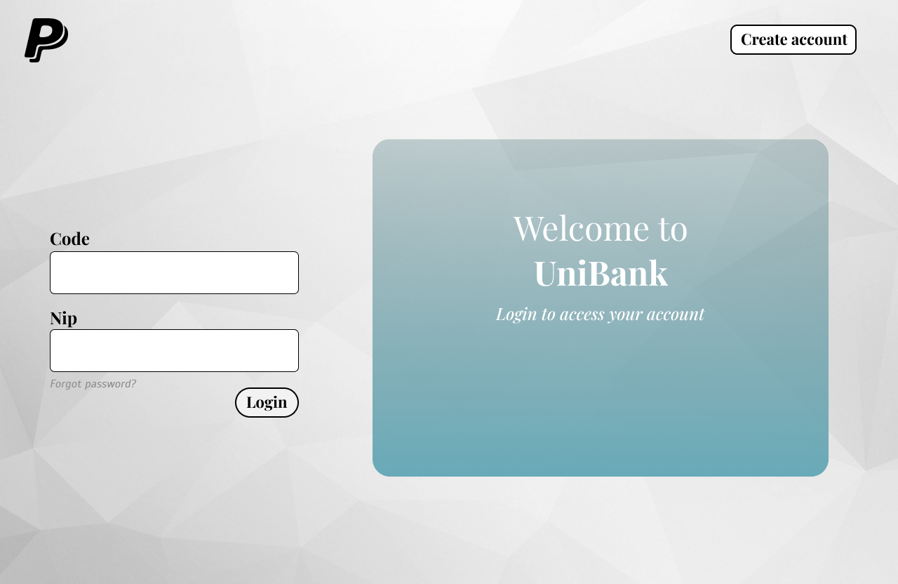

# Projet_Guichet_Banque

## Équipe
Nicholson Rainville Jacques
Jamil Fayad

## TP-2
- Implémentation des classes
- Implémentation de la classe de test pour GestionnaireGuichet 
- Diagramme de classe

## Design - Quelques pages en exemple
### Page de connexion

### Page principal client

### Page Création de compte

### Affichage compte Client

### Déposer et retirer

### Panel admin

## Informations 
### Identifiants
- Admin
  - Code : 0
  - nip : 1111
- Marc
  - code : 1
  - nip : 1222
- Michel
    - code : 2
    - nip : 1222
- Bob
    - code : 3
    - nip : 1222